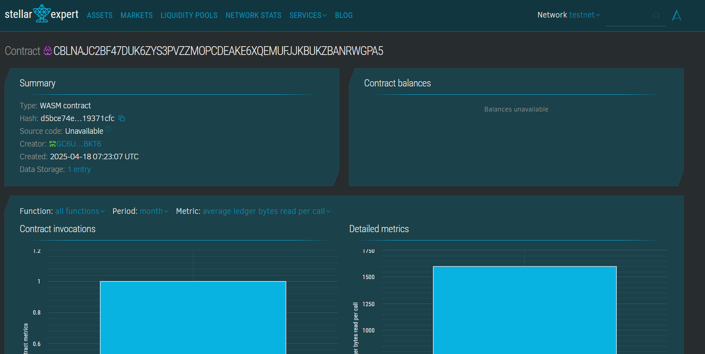

# Token-weighted Voting

## Project Description

This smart contract implements a voting system where participants can vote on options using the weight of their tokens. The voting power is proportional to the number of tokens a voter possesses.

## Project Vision

The vision is to create a decentralized, transparent, and fair voting mechanism for DAOs, communities, and blockchain-based governance platforms using the Soroban smart contract platform.

## Key Features

- 🔐 **Token-weighted Voting**: Voters can cast votes with weight based on their token holdings.
- 🗳️ **Multiple Options**: Allows setup of multiple voting choices.
- 📊 **Real-Time Result Viewing**: View live vote counts for each option.
- 🔁 **Reusability**: Can be easily adapted to multiple use cases (polls, elections, decisions).

## Future Scope

- 🪙 **Integration with Real Tokens**: Link vote weight directly to token balances (e.g., Stellar assets).
- 📅 **Voting Deadlines**: Add time-based expiration for voting sessions.
- 🧑‍⚖️ **Admin Controls**: Add admin-only access to create and reset polls.
- 📤 **Event Emission**: Emit events for better frontend tracking.
- 🌐 **Web UI**: Integrate with a frontend for user-friendly participation.

## Contract Details
CBLNAJC2BF47DUK6ZYS3PVZZMOPCDEAKE6XQEMUFJJKBUKZBANRWGPA5

